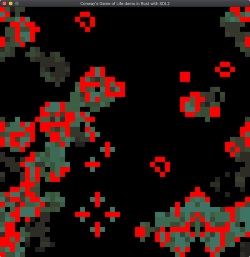

 

# Following along learning Rust ... :smiley: ...

Conway's game of life might serve as a good starter dough to explore the features of a new programming language. Add your brain's yeast as to your liking. Plant new seeds and add versions in C++, Go, ... Joe Marosco suggested an animal game quiz in his book *The Software Development Edge** ...

## More Examples
...

